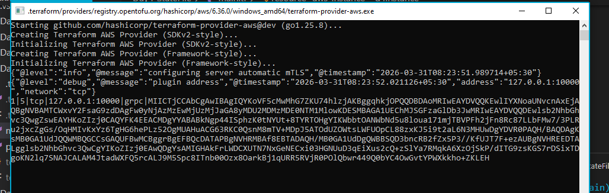

Opentofu is been forked from terraform hasicorp
This tool is under linux foundation 
IT will support cloudflare also
Coming to provider opentofu still using terraform providers only as terraform is still open soruce 

terraform completely changed license to business liecnes from 2025
where opentofu is completely open source

What is OpenTofu (in Terraform terms)?

👉 OpenTofu
is basically:

🔹 A community-driven fork of Terraform (v1.5.6)
🔹 Created after HashiCorp changed Terraform licensing (BUSL)

👉 So think like:

Terraform (before license change) = OpenTofu base
Terraform (after license change) = separate path
⚙️ Core Concept Mapping (Terraform vs OpenTofu)
Concept	Terraform	OpenTofu
CLI Tool	terraform	tofu
Language	HCL	HCL (same)
State file	terraform.tfstate	same
Providers	AWS, Azure, GCP	same providers
Modules	Yes	Yes
Workflow	init → plan → apply	init → plan → apply

👉 ✅ 100% same workflow

🔁 Command Comparison
Terraform	OpenTofu
terraform init	tofu init
terraform plan	tofu plan
terraform apply	tofu apply
terraform destroy	tofu destroy

👉 Just replace terraform → tofu

🧩 Example (Same Code Works)
Terraform code 👇
provider "aws" {
  region = "ap-south-1"
}

resource "aws_instance" "demo" {
  ami           = "ami-123"
  instance_type = "t2.micro"
}

👉 Run with:

tofu init
tofu apply

✅ No changes required

🏗️ Architecture (Same as Terraform)
Providers (AWS, Azure, etc.)
Resources
Modules
State Management
Backend (S3, remote, etc.)

👉 Internally same design philosophy

🚀 Why OpenTofu Came?

👉 Due to license change by HashiCorp

Before:
Terraform → Open Source (MPL)
After:
Terraform → BUSL (Business Source License)

👉 Community reacted → Created OpenTofu

🔍 Key Differences (Important for Real-Time)
1. Licensing
Terraform → ❌ Not fully open source now
OpenTofu → ✅ Fully open source
2. Future Direction
Terraform → Controlled by HashiCorp
OpenTofu → Community + Linux Foundation

👉 Backed by:

Linux Foundation
3. Enterprise Risk
Scenario	Best Choice
Strict open-source requirement	OpenTofu
Existing Terraform infra	Terraform (or gradual migration)
🔄 Migration (Terraform → OpenTofu)

👉 Very simple:

mv terraform.tfstate tofu.tfstate (optional rename)
tofu init

Or even:

tofu init -migrate-state

👉 No major rewrite needed

🧠 Real-Time DevOps Understanding

Think like this 👇

Terraform:

“Official product, but now license-controlled”

OpenTofu:

“Community-controlled Terraform”

⚡ When Should You Use OpenTofu?

Use OpenTofu if:

✔ You want no vendor lock-in
✔ Company prefers pure open source
✔ Long-term cost/legal safety
✔ You’re starting a new project

⚠️ When Terraform Still Makes Sense

✔ Existing infra already in Terraform
✔ Org using HashiCorp ecosystem (Vault, TFE)
✔ No licensing concerns

🧩 Simple Analogy

👉 Think like:

Terraform = Oracle Java
OpenTofu = OpenJDK

Same base, different governance

🔚 Final DevOps Insight (Important)

👉 For your role (Production Support / Cloud Ops):

You don’t need to relearn anything

Just:

terraform → tofu

👉 Your AWS, modules, state, debugging—all same
---------------------------------------------------

📄 OpenTofu Setup on Windows + Git Bash (Document)
Writing
🛠️ OpenTofu Installation & Git Bash Setup (Windows)
🔹 Step 1: Install using winget
winget install --exact --id=OpenTofu.Tofu
🔹 Step 2: Verify installation (PowerShell)
Get-Command tofu
🔹 Step 3: Get actual installation path
Split-Path (Get-Command tofu).Source
🔹 Step 4: Convert Windows path → Git Bash format
(Split-Path (Get-Command tofu).Source) -replace '\\','/' -replace '^C:','/c'

Example output:

/c/Users/Admin/AppData/Local/Microsoft/WinGet/Packages/OpenTofu.Tofu_Microsoft.Winget.Source_XXXX
🔹 Step 5: Add OpenTofu to Git Bash PATH
echo 'export PATH=$PATH:/c/Users/Admin/AppData/Local/Microsoft/WinGet/Packages/OpenTofu.Tofu_Microsoft.Winget.Source_XXXX' >> ~/.bashrc
🔹 Step 6: Reload Git Bash configuration
source ~/.bashrc
🔹 Step 7: Verify in Git Bash
tofu version
✅ Expected Output
OpenTofu vX.X.X
⚠️ Note (Important)

The winget path is version-dependent and may change after upgrades.

🚀 Recommended (Stable Setup)
New-Item -ItemType Directory -Path "C:\Users\Admin\bin" -Force
Copy-Item "C:\Users\Admin\AppData\Local\Microsoft\WinGet\Packages\OpenTofu.Tofu_*\\tofu.exe" "C:\Users\Admin\bin\"
echo 'export PATH=$PATH:/c/Users/Admin/bin' >> ~/.bashrc
source ~/.bashrc
🎯 Final Commands to Use
tofu init
tofu plan
tofu apply
tofu destroy
🧠 Pro DevOps Tip

In real projects, always document:

Installation steps
PATH configuration
Known issues (like WindowsApps / winget paths)
Recommended stable setup

👉 This becomes part of your team onboarding docs

------------------------------

Let’s focus on what OpenTofu is adding (or planning) beyond Terraform — not just “same but open source”.

🚀 What OpenTofu adds (beyond Terraform)
🧩 1. Fully Open Governance (Biggest Advantage)

👉 OpenTofu is:

Community-driven
Not controlled by a single vendor
Decisions are transparent

👉 Backed by:

Linux Foundation
🔥 Why this matters
No sudden license changes (like Terraform BUSL)
Safer for long-term enterprise use
🔐 2. No License Restrictions (Enterprise Safe)

Terraform (new versions):

❌ BUSL → restrictions on SaaS usage

OpenTofu:

✅ Truly open source (MPL/Apache style direction)
🔥 Enterprise impact
You can build internal platforms / SaaS without legal risk
⚙️ 3. Faster Community-Driven Features

OpenTofu roadmap is driven by:

Community needs
Not vendor priorities

👉 Example areas they are improving faster:

Better variable validation
Improved module usability
UX improvements in CLI
🧪 4. Experimentation & Innovation Freedom

OpenTofu can introduce:

Features Terraform may delay or avoid
Breaking improvements (if needed)
Community plugins/extensions

👉 Terraform is more conservative due to:

Backward compatibility
Enterprise contracts
🔄 5. State & Backend Flexibility (Future Direction)

OpenTofu is focusing on:

More flexible state handling
Easier remote backend integrations
Less dependency on proprietary platforms

👉 Terraform pushes:

Terraform Cloud / Enterprise
🔌 6. No Forced Ecosystem Lock-in

Terraform encourages:

Terraform Cloud
HashiCorp stack (Vault, Consul)

OpenTofu:

✅ Tool-agnostic
Works freely with:
GitHub Actions
Jenkins
OPA
Any backend
🧠 7. Transparency in Development

With OpenTofu:

Roadmap is public
Decisions are discussed openly
Community contributions matter
⚡ What OpenTofu DOES NOT change

Very important 👇

Area	Status
HCL language	Same
Providers (AWS, Azure)	Same
Commands	Same
Modules	Same

👉 So learning curve = zero

🧠 Real Enterprise Insight
Terraform approach:

“Stable, controlled, enterprise platform”

OpenTofu approach:

“Flexible, open, future-proof platform”

🔥 Practical Difference (Real Scenario)
Example: Your company wants to build internal IaC platform
Requirement	Terraform	OpenTofu
Build SaaS on top of IaC	⚠️ License concern	✅ No issue
Avoid vendor lock-in	❌	✅
Full customization	Limited	Full
🎯 Final Summary

👉 OpenTofu doesn’t just copy Terraform — it enables:

✅ True open-source freedom
✅ No legal risk
✅ Faster innovation
✅ No vendor lock-in
🧠 For YOU (DevOps Perspective)

Focus on:

Terraform → Enterprise stability
OpenTofu → Future flexibility

👉 Best engineers know both.